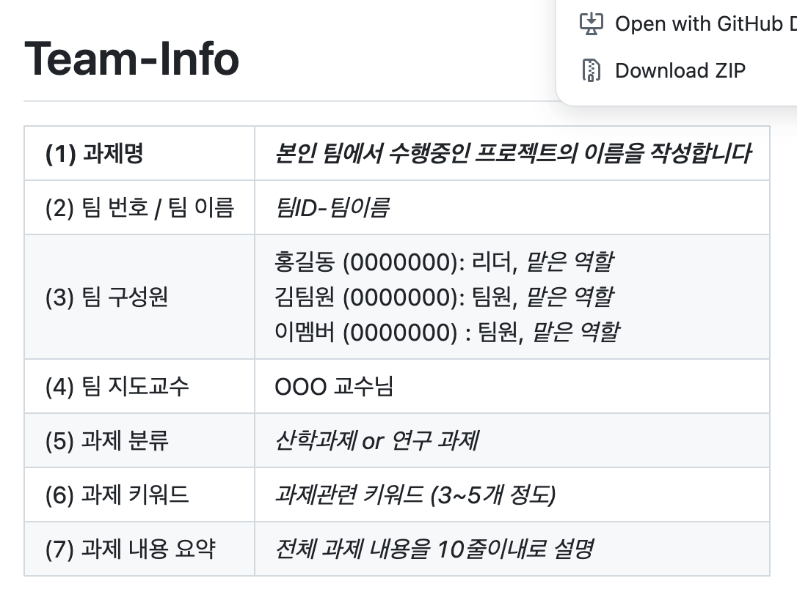

<!-- Template for PROJECT REPORT of CapstoneDesign 2025-2H, initially written by khyoo -->
<!-- 본 파일은 2025년도 컴공 졸업프로젝트의 <1차보고서> 작성을 위한 기본 양식입니다. -->
<!-- 아래에 "*"..."*" 표시는 italic체로 출력하기 위해서 사용한 것입니다. -->
<!-- "내용"에 해당하는 부분을 지우고, 여러분 과제의 내용을 작성해 주세요. -->

# Team-Info
| (1) 과제명 | *본인 팀에서 수행중인 프로젝트의 이름을 작성합니다* |
|:---  |---  |
| (2) 팀 번호 / 팀 이름 | *팀ID-팀이름* |
| (3) 팀 구성원 | 홍길동 (0000000): 리더, *맡은 역할*   김팀원 (0000000): 팀원, *맡은 역할*   이멤버 (0000000) : 팀원, *맡은 역할*			 |
| (4) 팀 지도교수 | OOO 교수님 |
| (5) 과제 분류 | *산학과제 or 연구 과제* |
| (6) 과제 키워드 | *과제관련 키워드 (3~5개 정도)*  |
| (7) 과제 내용 요약 | *전체 과제 내용을 10줄이내로 설명* |

 

# Project-Summary
| 항목 | 내용 |
|:---  |---  |
| (1) 문제 정의 | **[1] 문제 배경 (Problem Background)**  프로젝트 Pickin'은 다음과 같은 사회적·시장적 배경을 바탕으로 기획되었습니다.  1. **인재 수급 불균형 해결을 위한 외국인 유학생 유치 증가** - 저출산 및 학령인구 감소로 인한 국내 인재 부족 문제를 해결하기 위해 정부 및 지방자치단체는 ‘Study Korea 300K Project’ 정책 등 외국인 유학생 유치 정책을 강화하고 있음 - 비수도권 지역에서 특히 외국인 인재 확보 수요가 증가 출처: [한국대학신문](https://news.unn.net/news/articleView.html?idxno=569406)  2. **외국인 유학생의 높은 한국 취업 의지** - 국내 외국인 유학생 수는 2024년 기준 20.9만 명으로, 2023년 대비 15% 증가 - 잡코리아가 국내 거주 외국인 유학생 155명을 대상으로 진행한 설문에 따르면, 응답자의 86.5%가 한국 취업을 희망하며, 74.4%는 비수도권 취업도 긍정적으로 고려 출처: [머스트뉴스](http://mustnews.co.kr/View.aspx?No=3372992)  3. **현저히 낮은 외국인 유학생 전문 인력 취업률** - 높은 취업 의지와 정책적 지원에도 불구하고, 외국인 유학생의 전문 인력 취업률은 6%에 불과 - 이는 명백한 수요와 공급 간의 매칭 실패를 보여줌 출처: [디지털타임스](https://www.dt.co.kr/contents.html?article_no=2024101302109932064007)  
 **[2] 해결하고자 하는 문제점들 (Pain Points)**  프로젝트 Pickin'은 다음의 문제들을 해결하고자 합니다.   1. **외국인 유학생 : 채용 정보 접근성 부족** - 한국직업능력개발원의 ‘대학원 학위과정 외국인 유학생의 진로선호 탐색과 인적자원 활용 방안 연구’에 따르면, 2015~2019년 국내에서 석·박사 학위를 취득한 외국인 유학생 650명 중 49.5%가 채용 정보 부족을 한국 취업의 가장 큰 어려움으로 꼽음 - 외국인 대상 채용 공고가 지자체, 개별 기업, 플랫폼 등 여러 곳에 흩어져 있어 정보 탐색에 많은 시간이 소요됨 - 실제로 외국인 유학생 대상 공고만 300건 이상 존재함에도 불구하고 통합적으로 제공되는 서비스 부재 출처: [월간 리크루트](http://www.hkrecruit.co.kr/news/articleView.html?idxno=27694), [연합뉴스](https://www.yna.co.kr/view/AKR20210210139200530)  2. **기업 : 최적의 외국인 유학생 인재 탐색 어려움** - 외국인 유학생이 적절한 채용 정보를 찾지 못하면, 기업은 우수 인재를 만나기 어려워짐 - 이는 채용 과정의 비효율성과 사회적 비용 증가로 이어짐  
  **[3] Target Customer 정의**  프로젝트 Pickin'은 다음 두 사용자 집단을 위한 서비스입니다.  1. **외국인 유학생** 한국에서의 취업을 희망하지만, 정보 접근성 부족, 언어 장벽, 복잡한 지원 절차 등으로 실질적인 채용 정보를 찾기 어려운 사용자  2. **국내 기업 인사 담당자** 외국인 유학생 채용 수요는 있으나, 이를 위한 적절한 매칭 도구가 없어 효율적인 인재 채용에 어려움을 겪는 사용자 |
| (2) 기존연구와의 비교 | *유사한 과제/연구/서비스/시스템의 예를 들고, 각각의 장단점을 기술할 것. 특히, 본 과제가 유사과제에 대하여 갖는 장점을 부각할 것* |
| (2) 기존 연구와의 비교 |  **[1] 잡코리아**  국내 대표 취업 플랫폼으로, 다양한 산업·직무 분야의 채용공고를 제공하고 있음  **장점** - 국내 최대 규모의 채용공고 보유 - 이력서 기반 추천, 기업 정보, 설명회 등 다양한 구직 정보 제공  **한계** - 조건 필터 중심 추천으로 정밀성 부족 - 외국인 유학생 대상 맞춤 기능 미흡  **Pickin’의 차별점** - KoBERT 기반 텍스트 의미 분석으로 공고-지원자 간 유사도 측정 - 채용 공고 적합도 예측 기반 맞춤 추천 제공 - 외국인 유학생의 언어·비자 등 실질적 조건 반영  
 **[2] LinkedIn**  전 세계적으로 사용되는 글로벌 커리어 플랫폼으로, 경력 중심 AI 추천 시스템 제공  **장점** - 강력한 AI 추천 시스템으로 이력 기반 공고 자동 추천 - 글로벌 기업 네트워크, 스카우트 기능 등 탑재  **한계** - 한국어 지원 부족, 국내 채용 정보 로컬화 미흡 - 외국인 유학생 특화 기능 및 정보 없음  **Pickin’의 차별점** - KoBERT 기반 한국어 문맥 분석을 통한 정밀 추천 - TOPIK, 비자 등 국내 취업 필수 조건 반영 - 국내 채용 환경에 맞춘 로컬 최적화 추천 구조 설계  
 **[3] Wanted**  국내 AI 기반 채용 플랫폼으로, 경력직 중심의 추천 시스템 제공  **장점** - 사용자 행동 기반 AI 추천 및 자동 인터뷰 제안 기능 보유 - 보상금 제도 등 유입 유도 요소 다양  **한계** - 외국인 유학생 대상 기능 및 정보 고려 부족 - 경력직 데이터 중심 모델로 비전형 사용자 적용 한계  **Pickin’의 차별점** - 외국인 유학생을 위한 전용 알고리즘 설계 - 언어 능력, 비자 상태 등 유학생의 실제 조건 기반 추천 - 대상 특화 구조를 통해 기존 플랫폼과 본질적으로 차별화 |
| (3) 제안 내용 | *본 프로젝트에서 제시한 문제를 해결하기 위해 새롭제 제안하는 해결책 or 해결책들에 대하여 기술 .* |
| (4) 기대효과 및 의의 | *프로젝트의 결과물을 통하여 얻을 수 있는 기대효과 및 의의에 대하여 기술 .* |
| (5) 주요 기능 리스트 | *(3)에서 제안한 해결책들을 지원or구현하기 위하여 필요한 주요 기능 혹은 기능을을 List-up하고,   각각에 대하여 설명*   * 본 항목의 내용을 충실히 기재 바람니다. *|

 
 
# Project-Design & Implementation
| 항목 | 내용 |
|:---  |---  |
| (1) 요구사항 정의 | *프로젝트를 완성하기 위해 필요한 요구사항을 설명하기에 가장 적합한 방법을 선택하여 기술*   예)   - 기능별 상세 요구사항(또는 유스케이스)   - 설계 모델(클래스 다이어그램, 클래스 및 모듈 명세서)   - UI 분석/설계 모델   - E-R 다이어그램/DB 설계 모델(테이블 구조) |
| (2) 전체 시스템 구성 | *프로젝트를 위하여, SW 전체 시스템의 구조를 보인다. (가능하다면, 사용자도 포함)   주요 SW 모듈을 보이고, 각각의 역할을 기술한다.  만약, 오픈소스 혹은 외부 모듈을 사용한다면 이또한 기술한다.* |
| (3) 주요엔진 및 기능 설계 | *프로젝트의 주요 기능 혹은 모듈의 설계내용에 대하여 기술한다   SW 구조 그림에 있는 각 Module의 상세 구현내용을 자세히 기술한다.* |
| (4) 주요 기능의 구현 | *<주요기능리스트>에 정의된 기능 중 최소 2개 이상에 대한 상세 구현내용을 기술한다.* |
| (5) 기타 | *기타 사항을 기술*  |

 
