<!-- Template for PROJECT REPORT of CapstoneDesign 2025-2H, initially written by khyoo -->
<!-- 본 파일은 2025년도 컴공 졸업프로젝트의 <1차보고서> 작성을 위한 기본 양식입니다. -->
<!-- 아래에 "*"..."*" 표시는 italic체로 출력하기 위해서 사용한 것입니다. -->
<!-- "내용"에 해당하는 부분을 지우고, 여러분 과제의 내용을 작성해 주세요. -->

# Team-Info
| (1) 과제명 | 외국인 유학생을 위한 KoBERT 모델 기반 맞춤형 채용 공고 추천 서비스 |
|:---  |---  |
| (2) 팀 번호 / 팀 이름 | 13-tripleJ |
| (3) 팀 구성원 | 이민경(2076298): 리더, *BE,AI*   김지원(2176099): 팀원, *FE,AI*   엄하늘(2083013): 팀원, *BE,AI*			 |
| (4) 팀 지도교수 | 오세은 교수님 |
| (5) 과제 분류 | *산학과제* |
| (6) 과제 키워드 | *국제화 사회, 맞춤형 추천, KoBERT*  |
| (7) 과제 내용 요약 | Pickin’은 한국에서 취업을 희망하는 외국인 유학생을 위한 맞춤형 채용 공고 추천 서비스입니다. 외국인 유학생들은 다양한 사이트에 분산된 채용 정보를 찾기 어렵고, 기업들은 적합한 외국인 인재를 모집하는 데 어려움을 겪고 있습니다. Pickin’은 이러한 문제를 해결하기 위해 채용 공고와 지원자의 프로필을 분석하고, 채용 공고 적합도인 Pickin’ 지수를 예측합니다. 이를 기반으로 Pickin’ 지수가 높은 채용 공고를 자동 추천하여 유학생들이 최적의 기회를 찾을 수 있도록 돕고, 사용자가 원하는 채용 공고를 필터링하여 검색하거나 지원 내역과 관심 공고를 마이페이지에서 관리할 수 있도록 지원합니다. 또한, 지원자의 비자 상태를 반영해 결격 사유 여부를 자동 검토하여 불필요한 지원을 방지하며, KoBERT 모델을 활용해 외국인 유학생이 한국 문화에 맞는 자기소개서를 작성할 수 있도록 첨삭해주는 기능도 제공합니다. 향후 기업이 직접 채용 공고를 등록할 수 있는 기능을 추가해 외국인 유학생과의 매칭을 더욱 원활하게 할 계획입니다. Pickin’은 외국인 유학생과 한국 기업 간의 효율적인 채용 매칭을 지원하는 솔루션으로, 유학생들에게는 더 많은 취업 기회를, 기업에는 최적의 인재를 제공하는 서비스를 목표로 합니다. |

 

# Project-Summary
| 항목 | 내용 |
|:---  |---  |
| (1) 문제 정의 | **[1] 문제 배경 (Problem Background)**  프로젝트 Pickin'은 다음과 같은 사회적·시장적 배경을 바탕으로 기획되었습니다.  1. **인재 수급 불균형 해결을 위한 외국인 유학생 유치 증가** - 저출산 및 학령인구 감소로 인한 국내 인재 부족 문제를 해결하기 위해 정부 및 지방자치단체는 ‘Study Korea 300K Project’ 정책 등 외국인 유학생 유치 정책을 강화하고 있음 - 비수도권 지역에서 특히 외국인 인재 확보 수요가 증가 출처: [한국대학신문](https://news.unn.net/news/articleView.html?idxno=569406)  2. **외국인 유학생의 높은 한국 취업 의지** - 국내 외국인 유학생 수는 2024년 기준 20.9만 명으로, 2023년 대비 15% 증가 - 잡코리아가 국내 거주 외국인 유학생 155명을 대상으로 진행한 설문에 따르면, 응답자의 86.5%가 한국 취업을 희망하며, 74.4%는 비수도권 취업도 긍정적으로 고려 출처: [머스트뉴스](http://mustnews.co.kr/View.aspx?No=3372992)  3. **현저히 낮은 외국인 유학생 전문 인력 취업률** - 높은 취업 의지와 정책적 지원에도 불구하고, 외국인 유학생의 전문 인력 취업률은 6%에 불과 - 이는 명백한 수요와 공급 간의 매칭 실패를 보여줌 출처: [디지털타임스](https://www.dt.co.kr/contents.html?article_no=2024101302109932064007)  
 **[2] 해결하고자 하는 문제점들 (Pain Points)**  프로젝트 Pickin'은 다음의 문제들을 해결하고자 합니다.   1. **외국인 유학생 : 채용 정보 접근성 부족** - 한국직업능력개발원의 ‘대학원 학위과정 외국인 유학생의 진로 선호 탐색과 인적자원 활용 방안 연구’에 따르면, 2015~2019년 국내에서 석·박사 학위를 취득한 외국인 유학생 650명 중 49.5%가 채용 정보 부족을 한국 취업의 가장 큰 어려움으로 꼽음 - 외국인 대상 채용 공고가 지자체, 개별 기업, 플랫폼 등 여러 곳에 흩어져 있어 정보 탐색에 많은 시간이 소요됨 - 실제로 외국인 유학생 대상 공고만 300건 이상 존재함에도 불구하고 통합적으로 제공되는 서비스 부재 출처: [월간 리크루트](http://www.hkrecruit.co.kr/news/articleView.html?idxno=27694), [연합뉴스](https://www.yna.co.kr/view/AKR20210210139200530)  2. **기업 : 최적의 외국인 유학생 인재 탐색 어려움** - 외국인 유학생이 적절한 채용 정보를 찾지 못하면, 기업은 우수 인재를 만나기 어려워짐 - 이는 채용 과정의 비효율성과 사회적 비용 증가로 이어짐  
  **[3] Target Customer 정의**  프로젝트 Pickin'은 다음 두 사용자 집단을 위한 서비스입니다.  1. **외국인 유학생** 한국에서의 취업을 희망하지만, 정보 접근성 부족, 언어 장벽, 복잡한 지원 절차 등으로 실질적인 채용 정보를 찾기 어려운 사용자  2. **국내 기업 인사 담당자** 외국인 유학생 채용 수요는 있으나, 이를 위한 적절한 매칭 도구가 없어 효율적인 인재 채용에 어려움을 겪는 사용자 |
| (2) 기존 연구와의 비교 |  **[1] 잡코리아**  국내 대표 취업 플랫폼으로, 다양한 산업·직무 분야의 채용공고를 제공하고 있습니다.  **장점** - 국내 최대 규모의 채용공고 보유 - 이력서 기반 추천, 기업 정보, 설명회 등 다양한 구직 정보 제공  **한계** - 조건 필터 중심 추천으로 정밀성 부족 - 외국인 유학생 대상 맞춤 기능 미흡  **Pickin’의 차별점** - KoBERT 기반 텍스트 의미 분석으로 공고와 지원자 간 정량적 유사도 측정 - 유학생 대상 채용공고를 통합 수집하여, 정보가 분산된 채용 환경에서 탐색 편의성 제공 - 공고별 핵심 요구조건 분석을 통해 지원서 작성 가이드 등 실제 취업 준비 도구를 함께 제공  
 **[2] LinkedIn**  전 세계적으로 사용되는 글로벌 커리어 플랫폼으로, 경력 중심의 AI 추천 시스템을 제공합니다.  **장점** - 강력한 AI 추천 시스템으로 이력 기반 공고 자동 추천 - 글로벌 기업 네트워크, 스카우트 기능 등 탑재  **한계** - 한국어 지원 부족, 국내 채용 정보 로컬화 미흡 - 외국인 유학생 특화 기능 및 정보 없음  **Pickin’의 차별점** - KoBERT 모델을 활용한 한국어 특화 자연어 처리로, 국내 공고 문맥을 정밀하게 분석 - 국내 기업과 공고 중심으로 설계되어, 외국인 유학생이 실제로 접근 가능한 정보 제공 - TOPIK, 비자 등 국내 취업 필수 조건을 반영하여 유학생 현실 반영형 추천 시스템 구현  
 **[3] Wanted**  국내 AI 기반 채용 플랫폼으로, 경력직 중심의 추천 시스템을 제공합니다.  **장점** - 사용자 행동 기반 AI 추천 및 자동 인터뷰 제안 기능 보유 - 보상금 제도 등 유입 유도 요소 다양  **한계** - 외국인 유학생 대상 기능 및 정보 고려 부족 - 경력직 데이터 중심 모델로 비전형 사용자 적용 한계  **Pickin’의 차별점** - 외국인 유학생을 위한 전용 알고리즘 설계 - 언어 능력, 비자 상태 등 유학생의 복합적인 특성을 반영 - 단순 추천을 넘어, 공고와 지원자 간 실제 적합도를 수치화해 제공 |
| (3) 제안 내용 |  본 프로젝트는 외국인 유학생의 낮은 취업률과 채용 정보 접근성 부족 문제를 해결하기 위해, KoBERT 모델 기반 외국인 유학생 특화 채용공고 추천 시스템 Pickin’을 제안합니다.  **[1] 핵심 전략 (Core Strategy)**  - 사용자의 전공, 언어 능력, 비자 상태, TOPIK 등급, 대외활동 등의 취업 관련 데이터를 수집하고, 채용공고 본문과 요구 조건을 함께 분석하여 텍스트 의미 기반 유사도 계산을 수행 - 이를 통해 지원자와 공고 간의 정량적 적합도(Pickin 지수)를 산출하고, 맞춤형 공고를 추천   **[2] 유학생 특화 설계 요소 (User-specific Design)**  - 추천 과정에서 비자 조건, 언어 능력, TOPIK 등급 등 외국인 유학생의 실제 제약 요소를 필터링에 반영  - 단순 필터링이 아닌, 실질적인 적합도에 기반한 현실적인 추천 구조를 구현   |
| (4) 기대효과 및 의의 | 프로젝트 Pickin’은 외국인 유학생과 국내 기업 간의 효율적인 매칭을 통해 취업 기회 확대와 사회적 비용 절감을 동시에 기대할 수 있습니다.  **[1] 외국인 유학생의 취업 기회 확대**   Pickin’은 개인 맞춤형 채용 정보를 제공함으로써 유학생의 정보 탐색 부담을 줄이고 실제 취업 기회를 확대합니다.   **[2] 기업의 인재 탐색 효율화 및 사회적 비용 절감**   외국인 유학생 채용 조건에 기반한 맞춤 추천을 통해 기업의 인재 탐색 효율을 높이며 채용 과정에서의 시간·자원 낭비를 줄입니다.   **[3] 지역 균형 발전 기여**   비수도권 채용 수요에 맞춘 매칭을 통해 외국인 유학생의 지역 분산을 유도하고 지역 경제 활성화에 기여합니다.   **[4] 글로벌 고학력 인재 확보 및 국가 경쟁력 강화**   외국인 유학생 인재풀을 효과적으로 연결하여 고학력 전문 인력을 확보하고 국가 경쟁력 제고에 기여합니다. |
| (5) 주요 기능 리스트 | Pickin’은 외국인 유학생의 채용 정보 접근성 향상과 실질적인 취업 지원을 위해 다음과 같은 핵심 기능을 제공합니다.    **[1] 채용 공고 적합도 예측 기능**   KoBERT 모델을 활용하여 사용자의 전공, 언어, 비자 상태, TOPIK 등급 등의 데이터를 분석하고, 채용공고와의 정량적 적합도(Pickin 지수)를 산출하여 숫자로 시각화합니다.  **[2] 맞춤형 채용 공고 추천 기능**   예측된 적합도를 기반으로 사용자 조건에 최적화된 채용공고를 자동으로 추천하고, 사용자가 적합한 공고를 빠르게 확인 후 지원할 수 있도록 지원합니다.  **[3] 지원서 작성 가이드 제공 기능**   채용공고의 요구 조건을 분석하여 이력서 및 자기소개서 작성에 필요한 핵심 정보와 작성 팁을 제공함으로써 유학생의 언어 장벽과 준비 부담을 줄입니다. |

 
 
# Project-Design & Implementation
| 항목                | 내용                                                                                                                                                                                                                                                                                                                                                                                                                                                                                                                                                                                                                                                                                                                                                                                                                                                                                                                                                                                                                                                                                                                                                                                                                                                                                                                                                                                                                                                                                                                                                                                                                                                                                                                                                                                                                                                                                                                                                                                                                                                                                                                                                                                                                                                                                                                                                                                                                                                                                                                                                                                                                                                                                                                                                                                                                                                                                                                                                                                                                                                                                                                                                                                                                                                                                                                                                                                                                                                                                                                                                                                                                                                                                                                                                                                                                                                                                                                                                                                                                                                                                                                                                                                                                                                                                                                                                                                      |
|:------------------|-----------------------------------------------------------------------------------------------------------------------------------------------------------------------------------------------------------------------------------------------------------------------------------------------------------------------------------------------------------------------------------------------------------------------------------------------------------------------------------------------------------------------------------------------------------------------------------------------------------------------------------------------------------------------------------------------------------------------------------------------------------------------------------------------------------------------------------------------------------------------------------------------------------------------------------------------------------------------------------------------------------------------------------------------------------------------------------------------------------------------------------------------------------------------------------------------------------------------------------------------------------------------------------------------------------------------------------------------------------------------------------------------------------------------------------------------------------------------------------------------------------------------------------------------------------------------------------------------------------------------------------------------------------------------------------------------------------------------------------------------------------------------------------------------------------------------------------------------------------------------------------------------------------------------------------------------------------------------------------------------------------------------------------------------------------------------------------------------------------------------------------------------------------------------------------------------------------------------------------------------------------------------------------------------------------------------------------------------------------------------------------------------------------------------------------------------------------------------------------------------------------------------------------------------------------------------------------------------------------------------------------------------------------------------------------------------------------------------------------------------------------------------------------------------------------------------------------------------------------------------------------------------------------------------------------------------------------------------------------------------------------------------------------------------------------------------------------------------------------------------------------------------------------------------------------------------------------------------------------------------------------------------------------------------------------------------------------------------------------------------------------------------------------------------------------------------------------------------------------------------------------------------------------------------------------------------------------------------------------------------------------------------------------------------------------------------------------------------------------------------------------------------------------------------------------------------------------------------------------------------------------------------------------------------------------------------------------------------------------------------------------------------------------------------------------------------------------------------------------------------------------------------------------------------------------------------------------------------------------------------------------------------------------------------------------------------------------------------------------------------------------------|
| (1) 요구사항 정의       | **API 명세서**    1. 로그인   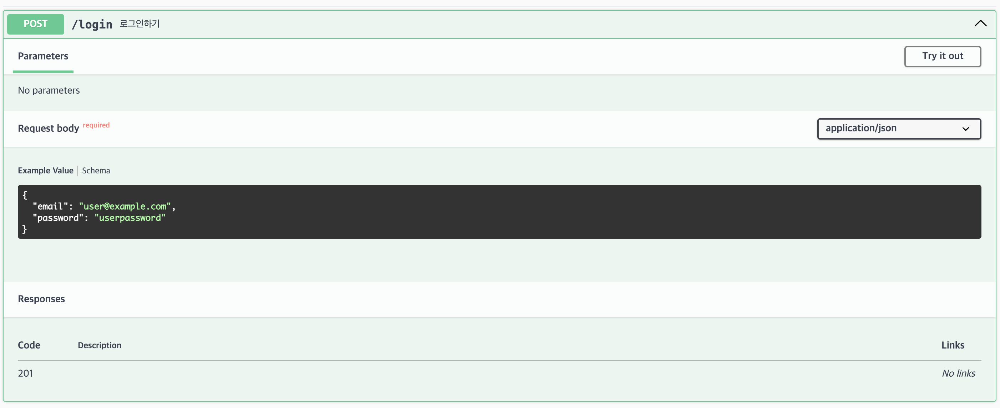   API: POST /login   설명: 로그인을 위한 API입니다. 사용자는 email과 password를 활용하여 로그인합니다. 이때, email과 password는 request body 형태로 전달됩니다.    2. 회원가입   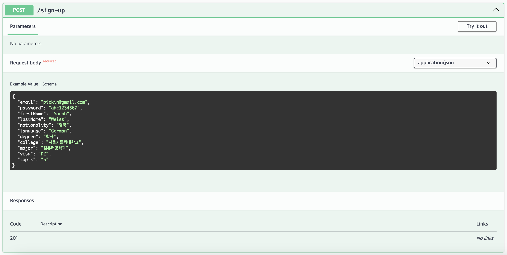   API: POST /sign-up   설명: 회원가입을 위한 API입니다. 사용자는 회원가입에 필요한 모든 정보를 활용하여 회원가입 합니다. 유학생의 경우, 회원가입 시 email, password, firstName, nationality 등의 정보가 필요합니다. 이때, email, password, firstName, nationality 등의 정보는 request body 형태로 전달됩니다.    3. 지원   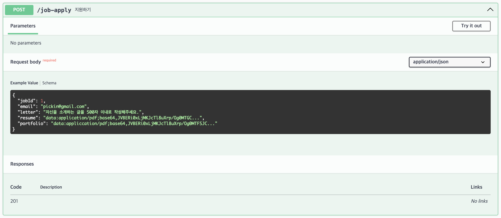   API: POST /job-apply   설명: 채용 공고에 지원하기 위한 API입니다. 유학생은 자기소개서, 이력서, 포트폴리오 등을 활용하여 채용 공고에 지원합니다. 이때, 자기소개서, 이력서, 포트폴리오 등의 정보는 request body 형태로 전달됩니다.    4. 공고 저장 및 저장 해제   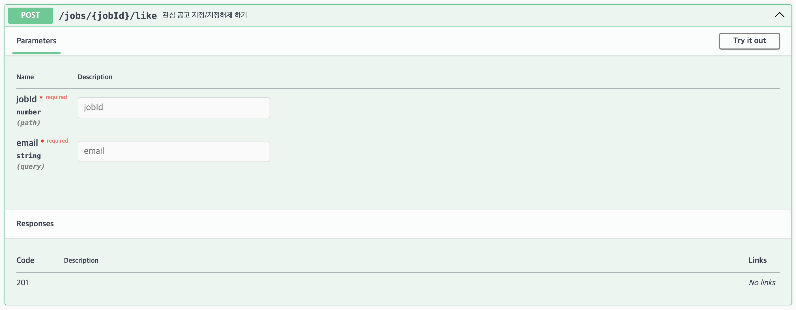   API: POST /jobs/:jobId/like 설명: 관심있는 공고를 유학생이 저장하거나 저장 해제할 수 있도록 하는 API입니다. 유학생은 채용 공고 id인 jobId와 자신의 email을 활용하여 공고를 저장할 수 있습니다. 그리고 이미 저장했던 공고를 저장 해제할 수도 있습니다.    5. 회원 정보 조회   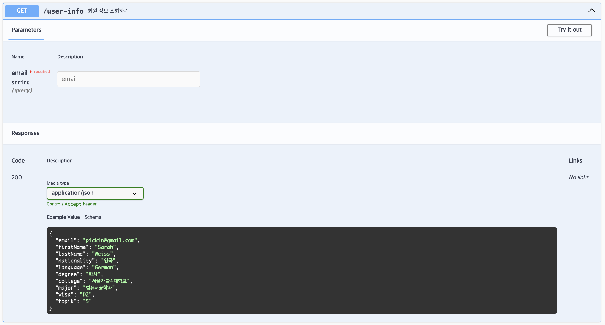   API: GET /user-info   설명: 회원 정보 조회를 위한 API입니다. 회원가입을 통해 Pickin 서비스의 회원이 된 사용자의 정보를 조회할 수 있습니다. 조회 대상이 되는 회원의 email 정보로 조회할 수 있으며, email은 query string의 형태로 전달됩니다.    6. 지원 현황 조회   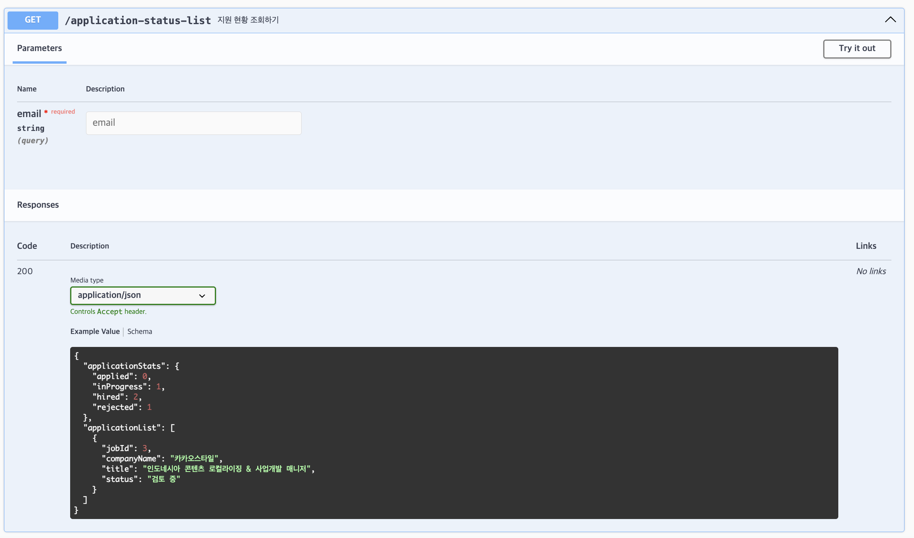   API: GET /application-status-list   설명: 유학생의 지원 현황을 조회하기 위한 API입니다. 조회 대상이 되는 회원의 email 정보로 조회할 수 있으며, email은 query string의 형태로 전달됩니다. 사용자는 API 호출을 통해 자신이 지원한 채용 공고 정보 및 지원 현황을 확인할 수 있습니다.    7. 채용 공고 조회   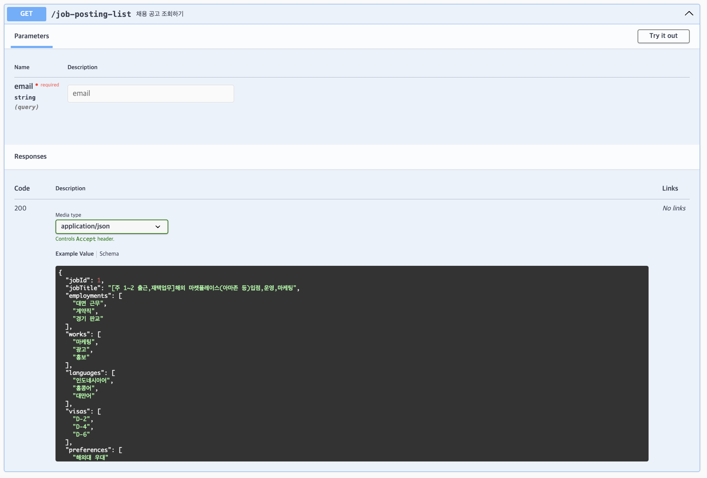   설명: 등록된 채용 공고를 조회하기 위한 API입니다. 사용자는 API 호출을 통해 채용 공고들의 상세 정보를 확인할 수 있습니다. 사용자가 로그인한 상태여야만 Pickin 지수 등의 개인화된 정보를 확인할 수 있습니다.     **DB 설계 모델 - E-R 다이어그램**   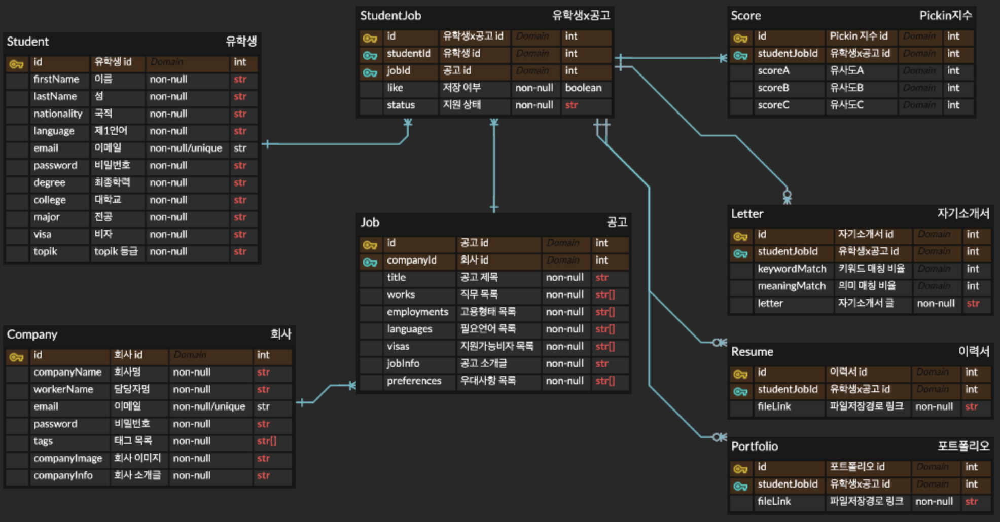   전체 E-R 다이어그램의 모습입니다.    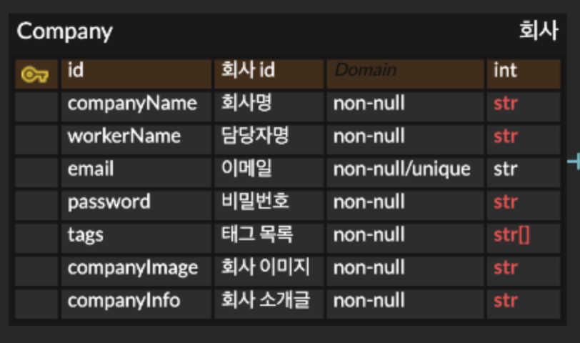   채용의 주체가 되는 회사를 관리하기 위한 테이블입니다.   - id: 회사를 구분하기 위한 primary key입니다.   - email: 각 회사의 email 정보는 unique 해야 합니다.   - tags: 회사의 특징을 나타내는 태그를 관리합니다. *ex. IT, 스타트업*    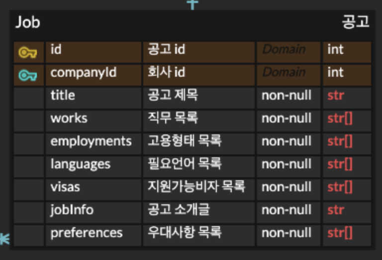   채용 공고를 관리하기 위한 테이블입니다.   - id: 채용 공고를 구분하기 위한 primary key입니다.   - companyId: 모든 채용 공고는 하나의 회사와 연결됩니다. 회사와 채용 공고는 one-to-many 관계입니다.   - works: 채용 공고와 관련된 직무 목록을 관리합니다. *ex. 마케팅, 광고*   - employments: 고용 형태를 관리합니다. *ex. 계약직, 인턴*   - preferences: 채용 시 우대 사항을 관리합니다. *ex. 한국어 능통자*    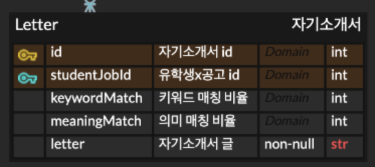   지원자의 자기소개서를 관리하기 위한 테이블입니다.   - id: 자기소개서를 구분하기 위한 primary key입니다.   - studentJobId: 모든 자기소개서는 하나의 studentJob과 연결됩니다. 그리고 유학생과 채용 공고 간 many-to-many 관계를 관리하기 위해 studentJob 테이블이 활용됩니다. studentJobId는 studentJob 테이블의 primary key입니다.   - keywordMatch: 자기소개서와 채용 공고 간 키워드 매칭 비율을 관리합니다.   - meaningMatch: 자기소개서와 채용 공고 간 의미 매칭 비율을 관리합니다.   - letter: 자기소개서 글 자체를 관리합니다.    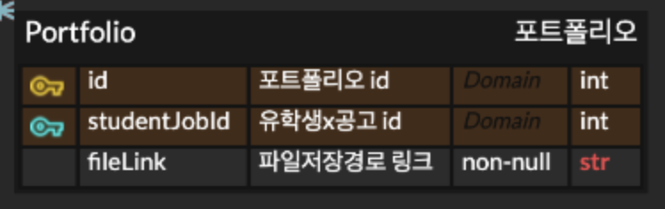   지원자의 포트폴리오를 관리하기 위한 테이블입니다.   - id: 포트폴리오를 구분하기 위한 primary key입니다.   - studentJobId: 모든 포트폴리오는 하나의 studentJob과 연결됩니다. 포트폴리오와 studentJob은 one-to-one 관계입니다.   - fileLink: 포트폴리오 파일이 저장된 위치를 관리합니다.    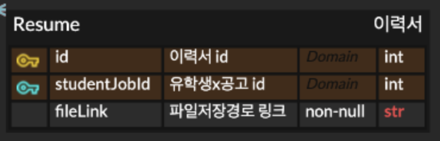   지원자의 이력서를 관리하기 위한 테이블입니다.   - id: 이력서를 구분하기 위한 primary key입니다.   - studentJobId: 모든 이력서는 하나의 studentJob과 연결됩니다. 이력서와 studentJob은 one-to-one 관계입니다.   - fileLink: 이력서 파일이 저장된 위치를 관리합니다.    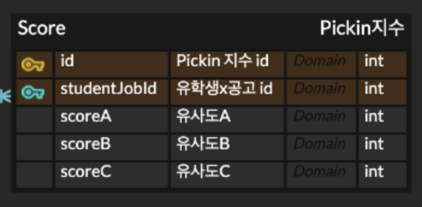   지원자의 Pickin 지수를 관리하기 위한 테이블입니다. Pickin 지수는 지원자와 채용 공고 간 적합도를 나타냅니다. score 테이블에서는 통합적인 Pickin 지수를 계산하기 위한 세부 항목을 관리합니다.   - id: score를 구분하기 위한 primary key입니다.   studentJobId: 모든 score는 하나의 studentJob과 연결됩니다. score와 studentJob은 one-to-one 관계입니다.   - scoreA: 지원자의 전공과 채용 공고의 우대 전공 간 적합도를 관리합니다.   - scoreB: 지원자의 경험과 직무 간 적합도를 관리합니다.   - scoreC: 지원자의 경험과 우대 사항 간 적합도를 관리합니다.    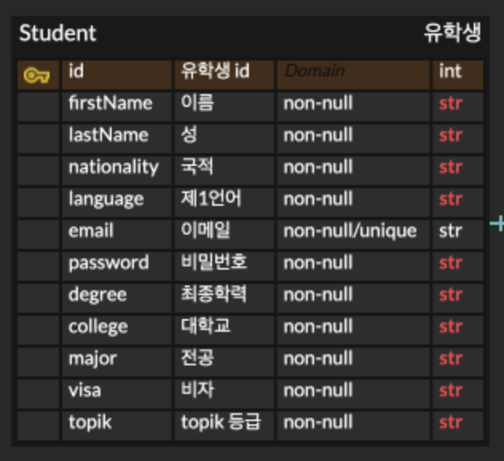   유학생 정보를 관리하기 위한 테이블입니다.   id: 유학생을 구분하기 위한 primary key입니다.   - email: 각 유학생의 email 정보는 unique 해야 합니다.    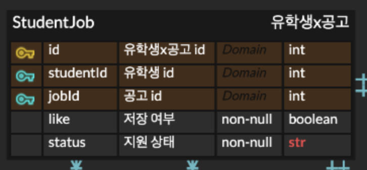   유학생과 채용 공고 간 many-to-many 관계를 관리하기 위한 테이블입니다. 한 명의 유학생은 여러 채용 공고에 지원하거나 여러 채용 공고를 저장할 수 있습니다. 그리고 하나의 채용 공고에 여러 유학생이 지원하거나 하나의 채용 공고를 여러 유학생이 저장할 수 있습니다.   - id: studentJob을 구분하기 위한 primary key입니다.   - like: 저장 여부를 관리합니다.   - status: 지원 상태를 관리합니다. *ex. 지원 완료, 합격*   |
| (2) 전체 시스템 구성     | **SW 아키텍처**   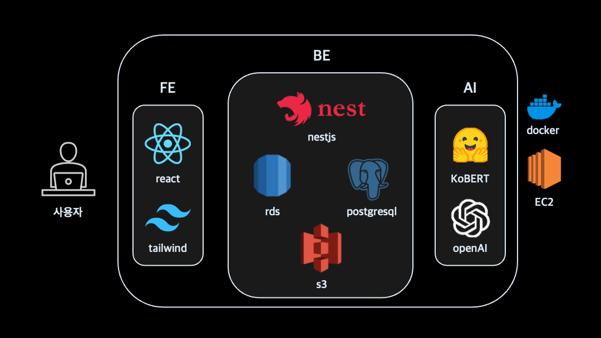   저희 Pickin'의 SW 아키텍처를 소개합니다.    1. **FE**   사용자는 user interface를 통해 Pickin' 서비스와 소통합니다. Pickin' 서비스의 프론트엔드는 React와 tailwind CSS로 구성되어 있습니다. React와 tailwind CSS를 활용함으로써, 보다 효율적인 개발이 가능하도록 하고 있습니다. 사용자 친화적인 UI를 구성하기 위해 기존 채용서비스의 UI를 참고하였습니다.    2. **BE**   Pickin' 서비스의 백엔드는 nestjs로 구성되어 있으며, SQL databse로는 AWS RDS에서 제공하는 postgresql을 사용하고 File storage로는 AWS S3를 사용합니다. nestjs를 활용해 보다 구조적인 개발을 하고 있습니다. 그리고 저희의 데이터베이스가 무결성을 갖추도록 하기 위해 postgresql의 강력한 트랜잭션 관리 기능을 활용하고, 이력서 및 포트폴리오 등의 정적 파일 관리에 S3를 활용합니다.    3. **AI**   Pickin' 서비스는 오픈소스인 KoBERT와 OpenAI의 ChatGPT-4o를 활용하여 AI 모델을 구성하였습니다. KoBERT는 한국어에 최적화된 BERT 기반 사전학습 모델로, 자연어 처리에 주로 활용됩니다. ChatGPT-4o는 긴 대화와 복잡한 질문을 처리할 수 있는 모델로, 기존 모델들보다 문맥 파악 및 분석 능력이 탁월해졌습니다. Pickin'은 KoBERT 모델을 활용하여 채용 공고와 자기소개서에서 단어 및 문장 단위로 임베딩을 추출합니다. 그리고 이를 기반으로 하여 지원자와 채용 공고 간 cosine similarity를 계산하고 적합도(Pickin 지수)를 도출합니다. 도출된 Pickin 지수와 채용 공고 및 자기소개서의 상세 내용을 활용하여 ChatGPT-4o가 지원자 맞춤 피드백을 제공합니다. 예를 들어, 지원자의 자기소개서에 추가되어야 할 키워드를 추천하거나 한국의 문화적 맥락을 반영하여 지원자의 역량이 더욱 잘 드러날 수 있도록 자기소개서를 첨삭합니다.    4. **배포**   Pickin' 서비스는 배포를 위해 AWS EC2와 docker를 사용합니다. FE/BE/AI 구현 내용을 docker 이미지로 생성하여 EC2 인스턴스에 배포할 계획입니다. docker를 활용하여 배포 과정을 단순화하고, EC2를 활용하여 배포된 서비스를 관리할 것입니다.                                                                                                                                                                                                                                                                                                                                                                                                                                                                                                                                                                                                                                                                                                                                                                                                                                                                                                                                                                                                                                                                                                                                                                                                                                                                                                                                                                                                                                                                                                                                                                                                                                                                                                                                                                                                                                                                                                                                                                                                                                                                                                                                                                                                                                                                                                                                                                                                                                                                                                                                                                                                                                                                                                                                                                                                                                                                                                                                                                                                                                      |
| (3) 주요 엔진 및 기능 설계 | **SW 아키텍처 내 모듈 설계**    저희 Pickin'에 활용된 주요 모듈들에 대해 소개합니다.    1. **KoBERT**   한국어에 특화된 BERT 기반 사전학습 모델인 KoBERT는 자연어 처리에 주로 활용됩니다. 따라서, 저희도 한국어로 작성된 채용 공고 및 자기소개서를 기반으로 한 임베딩 추출에 KoBERT 모델을 활용합니다. 단어 단위로 임베딩을 추출하여 한국어의 늬앙스를 분석하는 용도로 활용하고, 문장 단위로 임베딩을 추출하여 문장에 담긴 의도를 파악하여 더 나은 문장을 제안하기 위한 용도로 활용합니다.    참고: [about KoBERT](https://huggingface.co/skt/kobert-base-v1)    2. **ChatGPT-4o**   ChatGPT-4o는 복잡하고 긴 대화를 처리할 수 있을 뿐만 아니라, 문맥을 파악하는 추론 능력도 갖춘 모델입니다. 따라서, 저희도 Pickin 지수와 자기소개서 전문을 포함한 각종 정보를 활용하여 구체적인 피드백을 제공하는 데에 ChatGPT-4o를 활용합니다. 한국어와 한국 문화에 익숙하지 않은 외국인 유학생들이 본인의 역량을 더 명확하게 드러낼 수 있도록 돕기 위해 ChatGPT-4o를 활용합니다.    참고: [about ChatGPT-4o](https://openai.com/index/hello-gpt-4o/)                                                                                                                                                                                                                                                                                                                                                                                                                                                                                                                                                                                                                                                                                                                                                                                                                                                                                                                                                                                                                                                                                                                                                                                                                                                                                                                                                                                                                                                                                                                                                                                                                                                                                                                                                                                                                                                                                                                                                                                                                                                                                                                                                                                                                                                                                                                                                                                                                                                                                                                                                                                                                                                                                                                                                                                                                                                                                                                                                                                                                                                                                                                                                                                                                                                                                                                                                                                                                                                                                                                                                                                                                                       |
| (4) 주요 기능의 구현     | 1. **채용 공고 적합도 예측 기능**   채용 공고 적합도 예측 기능에는 지원자가 회원가입 시 입력한 정보들이 반영됩니다. 예를 들어 지원자의 국적이나 제1언어, 그리고 지원자의 사회 경험 등을 토대로 채용 공고 별 적합도를 예측합니다. 이를 위해, 채용 공고를 기반으로 하여 단어 단위의 임베딩을 추출합니다. 그리고 추출된 채용 공고 정보와 지원자 정보에 one-hot encoding, TF-IDF, binary encoding, ordinary encoding을 적용하여 변환합니다. 마지막으로, 변환된 데이터들 간의 cosine similarity를 계산하여 최종적인 적합도(Pickin 지수)를 도출합니다.    2. **맞춤형 채용 공고 추천 기능**   맞춤형 채용 공고 추천 기능에는, 앞서 계산한 Pickin 지수가 활용됩니다. 지원자가 기본적으로 갖춘 요건들을 기준으로 1차 필터링을 거칩니다. 예를 들어, 채용 공고가 요구하는 비자를 지원자가 가지지 못한 경우에는 해당 채용 공고를 추천하지 않습니다. 그리고 그 이후에는 Pickin 지수에 따라 채용 공고를 추천합니다. Pickin 지수가 높을수록 지원자의 직무 적합도가 높을 것으로 예상되기 때문에, Pickin 지수가 높은 채용 공고를 우선 추천합니다.    3. **지원서 작성 가이드 제공 기능**   지원서 작성 가이드에는 지원자가 작성한 자기소개서와 채용 공고가 활용됩니다. 최초에는 채용 공고 내용을 기반으로 하여 자기소개서에 포함하면 좋을 키워드를 추천하는 식의 가이드가 제공됩니다. 그리고 지원자가 자기소개서를 작성하게 되면, 이를 기반으로 심층적인 첨삭을 제공합니다. 먼저, 자기소개서와 채용 공고의 단어 단위 임베딩을 추출하여 키워드 매칭 비율 계산에 활용합니다. 그리고 자기소개서와 채용 공고의 문장 단위 임베딩을 추출하여 의미적 유사도 계산에 활용합니다. 각각의 임베딩 추출에는 모두 KoBERT 모델이 활용되며, cosine similarity를 계산합니다. 최종적으로 도출된 키워드 매칭 비율과 의미적 유사도, 그리고 채용 공고 전문과 자기소개서 전문을 활용하여 최종적인 피드백을 제공합니다. 이때, ChatGPT-4o가 한국의 문화적 맥락을 반영하여 부자연스러운 문장을 감지하고 자연스럽고 설득력 있는 문장을 추천합니다. 그리고 기업의 인재상을 분석하여 이에 걸맞는 지원자의 역략이 더욱 잘 드러날 수 있도록 돕습니다.                                                                                                                                                                                                                                                                                                                                                                                                                                                                                                                                                                                                                                                                                                                                                                                                                                                                                                                                                                                                                                                                                                                                                                                                                                                                                                                                                                                                                                                                                                                                                                                                                                                                                                                                                                                                                                                                                                                                                                                                                                                                                                                                                                                                                                                                                                                                                                                                                                                                                                                                                                                                                                                                                                                                                                                                                                                                                                                                                                                                                                                                                                                            |
| (5) 기타            | **구현 현황 (~3/30)**   - 프론트엔드 화면 구성 80% 완료(유학생 홈페이지, 마이페이지, 채용 공고 탭 등)   - 데이터베이스 설계 및 배포 완료   - 백엔드 API 구현 완료(회원가입, 채용 공고 지원, 지원 현황 조회 등)   - API 연동 50% 완료   - Pickin 지수 계산을 위한 벡터 변환 로직 구현 진행 중   - KoBERT 모델 활용 단어/문장 단위 임베딩 추출 로직 구현 진행 중     **향후 개발 계획**    - KoBERT 활용 임베딩 추출 및 ChatGPT-4o 기반 피드백 제공 기능 구현   - Pickin 지수 계산 로직 구현   - EC2 및 docker 기반 배포   - 사용자 테스트를 기반으로 한 기능 개선                                                                                                                                                                                                                                                                                                                                                                                                                                                                                                                                                                                                                                                                                                                                                                                                                                                                                                                                                                                                                                                                                                                                                                                                                                                                                                                                                                                                                                                                                                                                                                                                                                                                                                                                                                                                                                                                                                                                                                                                                                                                                                                                                                                                                                                                                                                                                                                                                                                                                                                                                                                                                                                                                                                                                                                                                                                                                                                                                                                                                                                                                                                                                                                                                                                                                                                                                                                                                                                                                                                                                                                                                                                                                                                                                                                                                                                                                                                                                   |

 
